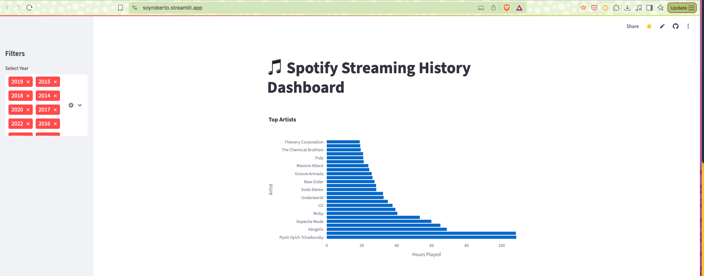
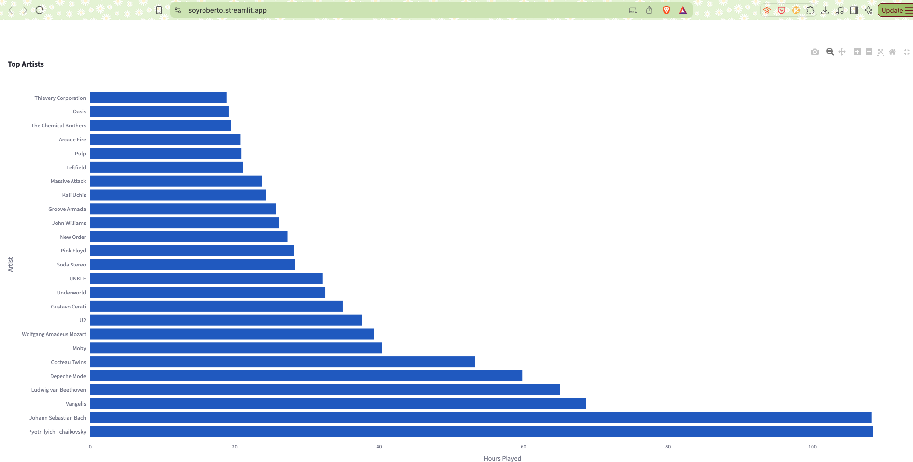

#
A View of my Spotify Music data with Streamlit. Years 2012-2023
---
##
Using my Spotify listening data I created these Graphics, each year has a most listened artist and it allows for the selection of year or years combined. Very insightful. I also did some PowerBi mapping for years 2012-2013 when the service didn't have the most listened feature available, can be found on my blog:[text] https://allthingscloud.net/discovering-spotify-before-it-was-trendy-my-707-hour-streaming-journey-2012-2013

### 
I have other repo for more visualizations using python:[text] (https://github.com/soyroberto/spotify)

